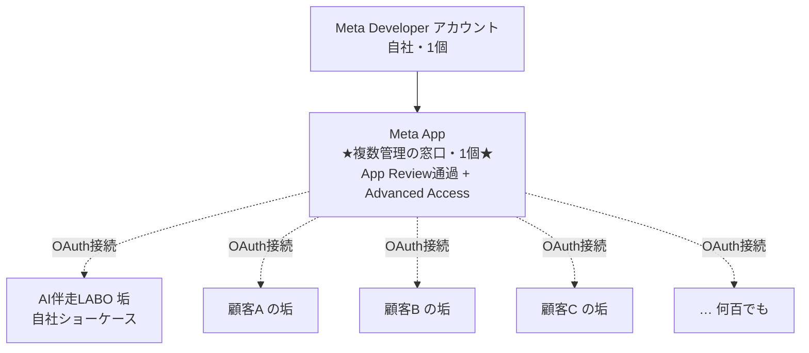
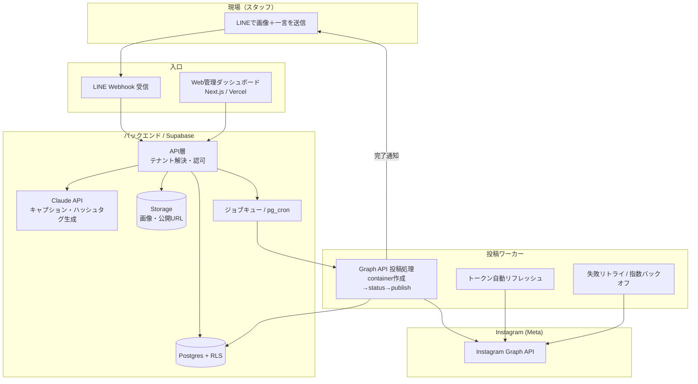
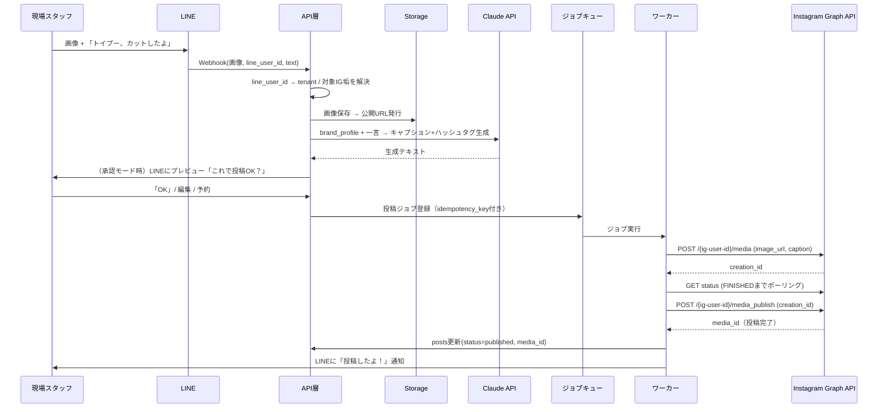
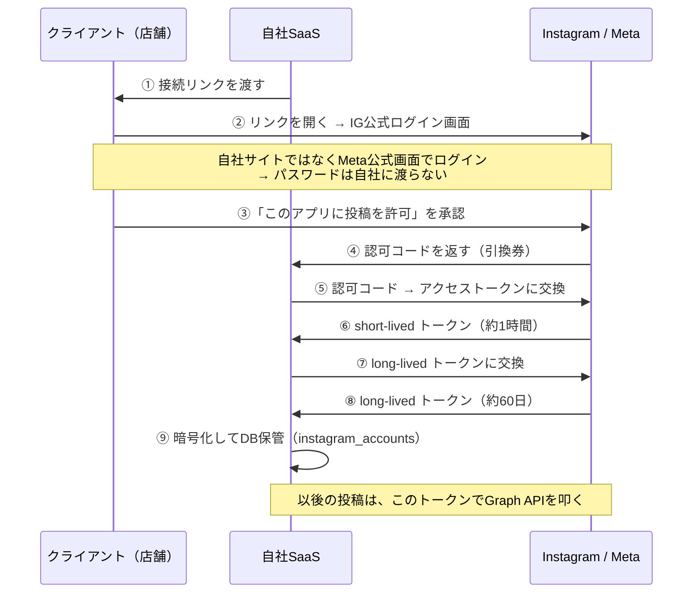
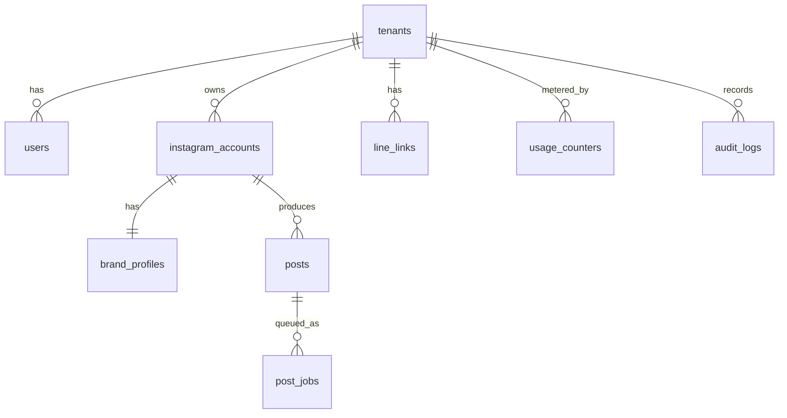

# AI伴走LABO / Instagram自動投稿SaaS アーキテクチャ設計書

> 画像と一言を投げ込むだけで、AIが文章・ハッシュタグを生成し、Instagramへ自動投稿する仕組みを
> **マルチテナントSaaS** として提供するための設計図。
>
> Status: Draft v1 / 2026-06-09 / 「設計確定」フェーズ

---

## 0. このドキュメントの位置づけ

- 本書は **設計の確定** を目的とする。実装は段階リリース（§8 ロードマップ参照）。
- 既存資産 `index.html`（提案LP）/ `sheet.html`（管理シートデモ）は「営業用の見せ球」として温存。本SaaSの実装基盤とは分離する。

---

## 1. 全体像と登場人物

| 登場人物 | 役割 |
| --- | --- |
| **AI伴走LABO アカウント** | サービスのショーケース兼集客用Instagram。最初のデモはここに投稿する。サービス自身の「1テナント目」でもある。 |
| **テナント（顧客）** | 美容室・ペットサロン等の店舗オーナー。1テナント = 1契約。 |
| **接続アカウント** | テナントが繋ぐInstagramビジネスアカウント。1テナントが複数持てる。 |
| **現場スタッフ** | 日々LINEで画像＋一言を投げる人。非エンジニア前提。 |
| **運用者/代行** | Web管理画面で承認・予約・履歴・複数垢を管理する人。 |

### 提供価値
「**写真を撮ってLINEで送る → 数十秒後にはプロっぽいキャプション付きで投稿予約が積まれている**」状態を、店舗オーナーが運用知識ゼロで手に入れる。

### アカウント管理の構造：「Meta App 1個 ＝ 複数顧客垢の管理窓口」

管理の親になるのは **Instagramアカウントではなく Meta App（アプリ）**。1つのMeta App に App Review ＋ Advanced Access を通せば、その App 経由で **多数の顧客垢を OAuth 接続して管理**できる。AI伴走LABO はこの App にぶら下がる **接続先の1垢（ショーケース）** にすぎず、他垢を束ねる親ではない。



> **注意（single point of failure）**: 全顧客が1つの Meta App に集約されるため、App自体のBAN/審査落ちは全顧客停止に直結する。公式APIのみ・スパム抑制・規約準拠で防止する（§6-1 / §6-8）。規模拡大時は App 分割戦略も選択肢。

---

## 2. 技術選定（確定事項）

| 領域 | 採用 | 理由 |
| --- | --- | --- |
| **Instagram投稿** | **公式 Instagram Graph API（Content Publishing）** | Meta公認でBANリスク最小。複数アカウント運用のSaaSでは事実上の唯一の安全解。 |
| **画像投入（日常）** | **LINE Messaging API**（Webhook受信） | 現場スタッフの使い勝手。学習コストゼロ。 |
| **管理・承認・課金** | **Web管理ダッシュボード（Next.js / Vercel）** | SaaSの王道。マルチテナントUIと相性最良。 |
| **DB / 認証 / ストレージ** | **Supabase（Postgres + Auth + RLS + Storage）** | テナント分離をRLSで強制。トークン暗号化保存。画像の公開URL発行。 |
| **AI文章生成** | **Claude API（claude-opus-4-8 / コスト最適化時 claude-sonnet-4-6）** | ブランドボイスをプロンプト注入。日本語キャプション品質が高い。 |
| **ジョブ/スケジューラ** | **Supabase pg_cron ＋ 専用ワーカー（or Upstash QStash）** | 予約投稿・トークンリフレッシュ・リトライの非同期処理。 |
| **画像ストレージ** | **Supabase Storage（公開バケット or 署名付きURL）** | Graph APIは `image_url` に到達可能な公開URLを要求するため。 |

> 非公式自動化（ログインエミュレーション系）は **不採用**。規約違反 → BAN → 複数垢芋づる全滅のリスクがSaaSの根幹を壊す。

---

## 3. システムアーキテクチャ



### レイヤ責務
- **入口（Edge）**: LINE Webhook と Web UI。ここではビジネスロジックを持たず、認証・テナント解決だけして Core に渡す。
- **Core**: テナント認可（RLS）、画像保存、AI生成、ジョブ登録。
- **Worker**: Meta APIとの実通信。**ここだけがGraph APIトークンに触れる**（漏洩面の最小化）。
- **Meta**: 外部依存。レート制限・トークン失効・APIエラーは全てここ由来。

---

## 4. 投稿フロー（シーケンス）



### 重要な設計判断：**承認モードをデフォルトにする（human-in-the-loop）**
- 完全自動投稿は「変なキャプション」「誤爆」「ブランド毀損」の事故源。
- **デフォルト = AI生成 → LINEでプレビュー → ワンタップ承認 → 投稿**。
- 「即時自動」はオプション（信頼が貯まった顧客向け）。デモでは即時自動を見せてインパクトを出す。

---

## 4.5 オンボーディング & アカウント接続の仕組み（OAuth）

### 考え方：パスワードではなく「期間限定の合鍵」を預かる
クライアントのID/パスワードは **一切受け取らない**。OAuthにより「投稿を許可する」という委任だけを受け取り、その証として **アクセストークン（投稿専用・期間限定の合鍵）** が発行される。トークンでできるのは許可された操作（投稿・コンテンツ管理）のみ。

### 接続フロー



### オンボーディング・チェックリスト

| # | クライアント側でやること | 種別 | 備考 |
| --- | --- | --- | --- |
| 1 | IGを **プロアカウント（Business/Creator）に切替** | 作業 | 無料・設定から一発。個人垢は接続不可 |
| 2 | **接続リンクからOAuth承認** | 作業 | ID/パスワードは渡さない。許可ボタンのみ |
| 3 | **ブランド情報のヒアリング**（店名・業種・地域・トーン・NGワード・定番ハッシュタグ・絵文字方針） | 情報 | 投稿品質の核（§7と連動）。唯一「聞き取る」項目 |
| 4 | **画像投入者のLINE連携**（友だち追加 → 紐付け） | 作業 | `line_links` に登録（§5） |

> Instagram Login 方式のため、クライアント側に **Facebookページも Metaビジネスアカウントも不要**。導入ハードルが低い。

### アクセストークンのライフサイクル
- short-lived（約1時間）→ **long-lived（約60日）に交換**して暗号化保存。
- **期限14日前に自動リフレッシュ**（cron、§6-2）。
- トークンは **垢ごとに独立保管** → 1つ失効・漏洩しても他垢に影響なし。
- トークンに触れるのは **Workerのみ**。

---

## 5. データモデル（論理設計）



| テーブル | 主要カラム | 役割 |
| --- | --- | --- |
| `tenants` | id, name, plan, status | 顧客（契約単位） |
| `users` | id, tenant_id, email, role | テナント内ユーザー（Supabase Auth連携） |
| `instagram_accounts` | id, tenant_id, ig_user_id, ig_username, **access_token(暗号化)**, token_expires_at, status, daily_quota_used | 接続先IG垢。**トークンは暗号化必須** |
| `brand_profiles` | id, ig_account_id, tone, persona, ng_words, default_hashtags, emoji_policy, language | アカウント別ブランドボイス。AI生成の核 |
| `line_links` | id, tenant_id, line_user_id, target_ig_account_id, verified | LINEユーザー ↔ どの垢に投稿するかの紐付け |
| `posts` | id, ig_account_id, image_url, generated_caption, hashtags, status, scheduled_at, published_media_id, error, **idempotency_key** | 投稿の本体。冪等キーで二重投稿防止 |
| `post_jobs` | id, post_id, type, attempts, next_run_at, last_error | 非同期ジョブ（投稿/リトライ/予約） |
| `usage_counters` | tenant_id, period, posts_count, ai_tokens | 課金・レート集計 |
| `audit_logs` | id, tenant_id, actor, action, payload, created_at | 監査証跡 |

### 状態遷移（posts.status）
`draft → pending_approval → queued → publishing → published`
（失敗時）`→ failed → (retry) → queued` / 上限超過で `→ dead`

---

## 6. リスクヘッジ設計（複数アカウント運用の肝）

ここが今回のSaaSの生命線。各リスクと対策を明記する。

### 6-1. アカウントBANリスク
- **公式Graph APIのみ使用**（非公式ゼロ）。
- **1 Meta App + OAuth方式**で各テナントが自分のIG垢を接続。接続方式は **「Instagram API with Instagram Login」を採用** → 顧客にFacebookページ連携を強制せずに済む（2024年7月提供開始。旧 Facebook Login 方式はFBページ必須だった）。対象は **Business / Creator（プロ）アカウントのみ**（個人垢は不可）。
- 自社が所有しない顧客垢に提供するため、**App Review で `instagram_content_publish` を取得 ＋ Advanced Access ＋ Business Verification が必須**。初回却下されやすく審査は数日〜数週間 → 早期着手。
- **規約遵守の自動ガード**: スパム的連投の抑制、同一画像連投の検知、ハッシュタグ過剰（30個上限）チェック。
- **App単位の権限を最小に**: 投稿に必要なスコープのみ。App BAN自体のリスクを下げる。

### 6-2. アクセストークン管理
- long-lived token（約60日）を **暗号化して保存**（アプリ層暗号 + Supabase Vault/KMS）。
- **期限14日前に自動リフレッシュするcronジョブ**。失敗したら failed としてマーク。
- **失効検知 → 該当テナントに再認証を促す通知**（LINE/メール/管理画面バナー）。
- トークンに触るのは **Workerのみ**。Web/Edgeからは参照不可（漏洩面の最小化）。

### 6-3. レート制限
- IGは **1アカウントあたり50投稿/24h**（ローリング。カルーセルは1投稿としてカウント）。
- `instagram_accounts.daily_quota_used` で消費を追跡し、超過分は **キューで翌窓に繰り越し**。
- アプリ全体のAPI呼び出しレートも監視（Business Use Case rate limit）。

### 6-4. 投稿失敗のリトライ
- container作成→status確認→publish の3ステップは各々失敗しうる。
- **指数バックオフ＋最大試行回数**。超過で `dead` にして人間に通知。
- container は作成後しばらく有効 → status ポーリングでFINISHED待ち（IN_PROGRESS/ERROR を判定）。

### 6-5. テナント分離（マルチテナント安全性）
- **Postgres RLS** で全テーブルに `tenant_id` ベースのポリシー。アプリのバグでも他テナントのデータに触れない。
- トークン・画像など機微データはテナント単位でスコープ。
- **監査ログ** で誰がいつ何をしたか追跡可能に。

### 6-6. 冪等性 / 二重投稿防止
- 投稿ジョブに `idempotency_key`（画像ハッシュ＋垢＋日付など）。
- Webhookの再送（LINEは再送あり）でも二重投稿しない。

### 6-7. 監視・可観測性
- ダッシュボードで **投稿成否率・トークン残日数・レート消費・失敗ジョブ** を可視化。
- 失効間近トークン / 連続失敗 / レート枯渇は **アラート通知**。

### 6-8. プラットフォーム依存リスク（事業リスク）
- Meta APIの仕様変更・審査落ちは事業リスク。**API層を抽象化**し、将来の投稿先追加（Threads / X / TikTok等）に備える `Publisher` インターフェースを切る。

---

## 7. ブランドボイス（AI生成）の設計

AI生成の品質＝サービスの価値。`brand_profiles` を以下の軸で持つ：

- **tone**: 親しみ系 / 上品系 / 元気系 など
- **persona**: 「トリミングサロンのやさしい店長」等の話者設定
- **ng_words**: 使ってはいけない語（誇大表現・他店比較など）
- **default_hashtags**: 定番タグ群（地域名・業種・店名）＋AIが画像から動的生成するタグ
- **emoji_policy**: 絵文字の量・種類
- **language**: 日本語/多言語

生成プロンプトは「ブランドプロファイル ＋ 現場の一言 ＋ 画像の内容（必要ならVision）」を合成。**生成は必ずpostsにドラフト保存**し、承認/編集を経て確定。

---

## 8. 段階的ロードマップ

| Phase | ゴール | 内容 | 規模感 |
| --- | --- | --- | --- |
| **Phase 0：デモ** | AI伴走LABOで「画像→自動投稿」が動く | LINE Webhook → Claude生成 → Graph APIでAI伴走LABO 1垢に投稿（即時自動）。承認・課金なし。最小テーブル(`instagram_accounts`,`posts`)のみ | 最速・見せ球 |
| **Phase 1：MVP SaaS** | 数テナントが自分の垢を繋いで使える | OAuth接続、承認モード、Web管理画面（履歴・予約・ブランド設定）、RLS、トークン自動リフレッシュ、リトライ | 商用最小 |
| **Phase 2：スケール** | 複数垢・課金・運用代行 | 複数IG垢切替、課金/従量メーター、監視ダッシュボード、アラート、監査ログ | 本格運用 |
| **Phase 3：拡張** | 投稿先・分析の拡張 | Threads/X等のマルチ投稿、投稿分析、AI改善提案 | 差別化 |

> **Phase 0 はトークンを手動発行（自分の垢）で良い**。OAuthフローやApp Reviewは Phase 1 から。デモを最速で出すための割り切り。

---

## 9. 未決事項 / 次のアクション

- [ ] **Meta App申請の準備**（Business Verification、`instagram_content_publish` のApp Review）。Phase 1の律速になりがち → 早めに着手。
- [ ] LINE公式アカウント（Messaging API）の発行。
- [ ] Claudeプロンプト設計（ブランドボイス → キャプション）の試作と品質検証。
- [ ] 画像の公開URLポリシー（公開バケット vs 署名付き、保持期間）の確定。
- [ ] 課金モデル（投稿数従量 / 月額固定 / 垢数）の決定。
- [ ] Phase 0 のスコープを切って実装着手するか判断。

---

## 付録：Phase 0 を実装するなら最小構成

```
LINE公式アカウント（Messaging API）
  └─ Webhook（Next.js API Route / Vercel）
       ├─ 画像を Supabase Storage に保存 → 公開URL
       ├─ Claude API でキャプション+ハッシュタグ生成
       └─ Instagram Graph API（AI伴走LABO垢, 手動発行トークン）
            └─ media作成 → status → publish
```
最小テーブルは `posts` だけでも成立。まずは「動く」を最優先。
```
